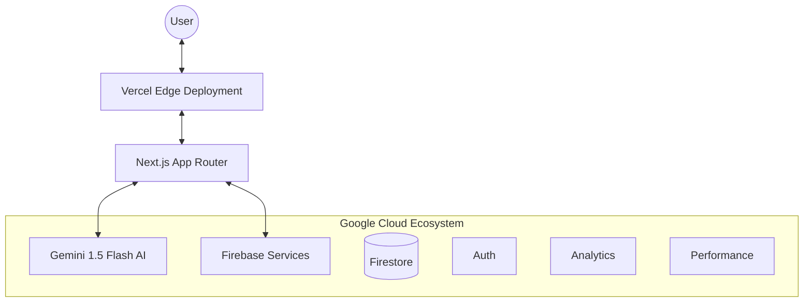

# Enterprise Architecture

The Election AI Assistant is built with a focus on scalability, security, and low latency, leveraging the Google Cloud and Vercel ecosystems.

## High-Level Architecture

## Key Components

### 1. AI Processing Pipeline
-   **VoterPulse Lens**: Uses Gemini 1.5 Flash to extract and redact PII from voter documents.
-   **Truth Guardian**: Uses Gemini 1.5 Pro to verify election rumors against real-time data.
-   **Manifesto Summary**: Generates concise, action-oriented summaries of candidate manifestos.

### 2. Firebase Integration
-   **Authentication**: Anonymous auth for secure session management.
-   **Firestore**: Real-time logging of scan activities (with privacy in mind).
-   **Analytics & Performance**: Real-time monitoring of user engagement and system latency.

### 3. PII Redaction Strategy
All sensitive data (EPIC numbers, phone numbers) is masked at the AI level before reaching the client, ensuring security-first design.

### 4. Scalability & Performance
-   **Vercel Edge**: Global distribution for low-latency responses.
-   **React Server Actions**: Secure server-side processing for AI tasks.
-   **Memoization**: Use of `React.memo`, `useMemo`, and `useCallback` to minimize re-renders.
